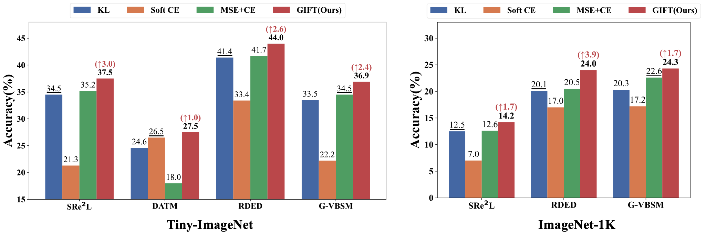

## GIFT: Unlocking Full Potential of Labels in Distilled Dataset at Near-zero Cost

[Xinyi Shang](https://shangxinyi.github.io/), [Peng Sun](https://sp12138.github.io/), [Tao Lin](https://tlin-taolin.github.io/)

[`OpenReview`](https://openreview.net/forum?id=FoF5RaA3ug&referrer=%5BAuthor%20Console%5D(%2Fgroup%3Fid%3DICLR.cc%2F2025%2FConference%2FAuthors%23your-submissions)) | [`BibTeX`](#bibliography)

This is an official PyTorch implementation of the paper **GIFT: Unlocking Full Potential of Labels in Distilled Dataset at Near-zero Cost (ICLR 2025)**. In this work, we:

- To the best of our knowledge, this paper is the first to provide a comprehensive comparison of loss functions for label utilization in dataset distillation. Our study reveals the intriguing fact that models trained on synthetic datasets are ***highly sensitive*** to the choice of loss function.
- We propose GIFT, a simple and universal label utilization algorithm including label refinement and a cosine similarity-based loss function. GIFT is built on top of the off-the-shelf dataset distillation methods and requires no extra information, thus raising ***no additional cost***. Moreover, we provide a theoretical analysis to support the proposed use of cosine similarity.
- We identify a critical issue that has been overlooked in prior research: ***cross-optimizer generalization***. We reveal that traditional loss functions suffer from significant robustness deficiencies when applied across different optimizers. In contrast,GIFT significantly enhances dataset distillation methods in cross-optimizer generalization. We conduct both empirical and theoretical analyses of this challenge.
- Experiments demonstrate that GIFT significantly improves performance over the state-of-the-art dataset distillation methods across varying scales and resolutions datasets, particularly for large-scale dataset distillation tasks. Furthermore, GIFT significantly enhances dataset distillation methods in cross-architecture, cross-optimizer generalization and proves advantageous in applications such as continual learning.

## Abstract

<p align="center">

</p>

Recent advancements in dataset distillation have demonstrated the significant benefits of employing soft labels generated by pre-trained teacher models. In this paper, we introduce a novel perspective by emphasizing the full utilization of labels. We first conduct a comprehensive comparison of various loss functions for soft label utilization in dataset distillation, revealing that the model trained on the synthetic dataset exhibits high sensitivity to the choice of loss function for soft label utilization. This finding highlights the necessity of a universal loss function for training models on synthetic datasets. Building on these insights, we introduce an extremely simple yet surprisingly effective plug-and-play approach, GIFT, which encompasses soft label refinement and a cosine similarity-based loss function to efficiently leverage full label information. Extensive experiments indicate that GIFT consistently enhances state-of-the-art dataset distillation methods across various dataset scales, without incurring additional computational costs. Importantly, GIFT significantly enhances cross-optimizer generalization, an area previously overlooked. For instance, on ImageNet-1K with IPC = 10, GIFT enhances the state-of-the-art method RDED by 30.8% in cross-optimizer generalization

## Usage

### Requirements

```
torchvision==0.16.0
torch==2.1.0
```

### Pytorch implementation code

```python
# num_class : number of classes
# output : tensor of model outputs
# soft_label : Tensor, shape=[bsz, C]
# hard_label : Tensor, shape=[bsz, 1]
# alpha : smoothing parameter for label smoothing

def GIFT(num_class, output , soft_label, hard_label, alpha):
    # apply label smoothing to hard label
    smooth_label = label_smoothing(hard_label, num_class, alpha)
    # refine soft label
    soft_label = F.normalize(soft_label, dim=1)
    smooth_label = F.normalize(smooth_label, dim=1)
    refined_soft_labels = weight * smooth_label + (1 - weight) * soft_label
    # calculate the coisen similariy
    loss = F.cosine_similarity(output, refined_soft_labels, dim=1) 
    return loss

```

### Synthetic Datasets

Our method does not involve any distilling datasets process. We obtain all synthetic datasets directly from the source data provided by the authors.

- SRe$^2$L: [https://github.com/VILA-Lab/SRe2L](https://github.com/VILA-Lab/SRe2L) 
- RDED: [https://github.com/LINs-lab/RDED](https://github.com/LINs-lab/RDED)
- DATM: [https://gzyaftermath.github.io/DATM/](https://gzyaftermath.github.io/DATM/)
- G-VBSM: [https://github.com/shaoshitong/G_VBSM_Dataset_Condensation](https://github.com/shaoshitong/G_VBSM_Dataset_Condensation)
- CDA: [https://github.com/VILA-Lab/SRe2L/tree/main/CDA](https://github.com/VILA-Lab/SRe2L/tree/main/CDA)

### How to Run

We evaluate all synthetic data in  [`eval_syn_data.py`](eval_syn_data.py). To facilitate experiments running, we provide [`scripts`](scripts/) for running the experiments in the paper. For instance, to assess the performance of synthetic data generated via `RDED` on the ImageNet-1K dataset with $\texttt{IPC} = 10$ using a ResNet-18 model, the following command can be executed:

```shell
python eval_syn_data.py --method 'rded' --criterion_name 'gift'  --dataset 'imagenet-1k' --model 'resnet18' --ipc 10
```


### Pre-trained Teacher Models

Following [SRe$^2$L](https://github.com/VILA-Lab/SRe2L), we adapt official [Torchvision code](https://github.com/pytorch/vision/tree/main/references/classification) to train the observer models from scratch.
All our pre-trained observer models listed below are available at [link](https://drive.google.com/drive/folders/1HmrheO6MgX453a5UPJdxPHK4UTv-4aVt?usp=drive_link).

| **Dataset**    | **Backbone**        | **Top1-accuracy** | **Input Size**   |
| -------------- | ------------------- | ----------------- | ---------------- |
| CIFAR10        | ResNet18 (modified) | 93.86             | 32 $\times$ 32   |
| CIFAR10        | Conv3               | 82.24             | 32 $\times$ 32   |
| CIFAR100       | ResNet18 (modified) | 72.27             | 32 $\times$ 32   |
| CIFAR100       | Conv3               | 61.27             | 32 $\times$ 32   |
| Tiny-ImageNet  | ResNet18 (modified) | 61.98             | 64 $\times$ 64   |
| Tiny-ImageNet  | Conv4               | 49.73             | 64 $\times$ 64   |
| ImageNet-Nette | ResNet18            | 90.00             | 224 $\times$ 224 |
| ImageNet-Nette | Conv5               | 89.60             | 128 $\times$ 224 |
| ImageNet-Woof  | ResNet18            | 75.00             | 224 $\times$ 224 |
| ImageNet-Woof  | Conv5               | 67.40             | 128 $\times$ 128 |
| ImageNet-10    | ResNet18            | 87.40             | 224 $\times$ 224 |
| ImageNet-10    | Conv5               | 85.4              | 128 $\times$ 128 |
| ImageNet-100   | ResNet18            | 83.40             | 224 $\times$ 224 |
| ImageNet-100   | Conv6               | 72.82             | 128 $\times$ 128 |
| ImageNet-1k    | Conv4               | 43.6              | 64 $\times$ 64   |

## Bibliography

If you find this repository helpful for your project, please consider citing our work:

```
@inproceedings{shanggift,
  title={GIFT: Unlocking Full Potential of Labels in Distilled Dataset at Near-zero Cost},
  author={Shang, Xinyi and Sun, Peng and Lin, Tao},
  booktitle={The Thirteenth International Conference on Learning Representations (ICLR)},
  year={2025}
}

```

## Reference

Our code has referred to previous work:
- [Squeeze, Recover and Relabel: Dataset Condensation at ImageNet Scale From A New Perspective](https://github.com/VILA-Lab/SRe2L)
- [Dataset Condensation via Efficient Synthetic-Data Parameterization](https://github.com/snu-mllab/Efficient-Dataset-Condensation)
- [On the Diversity and Realism of Distilled Dataset: An Efficient Dataset Distillation Paradigm](https://openaccess.thecvf.com/content/CVPR2024/papers/Sun_On_the_Diversity_and_Realism_of_Distilled_Dataset_An_Efficient_CVPR_2024_paper.pdf)